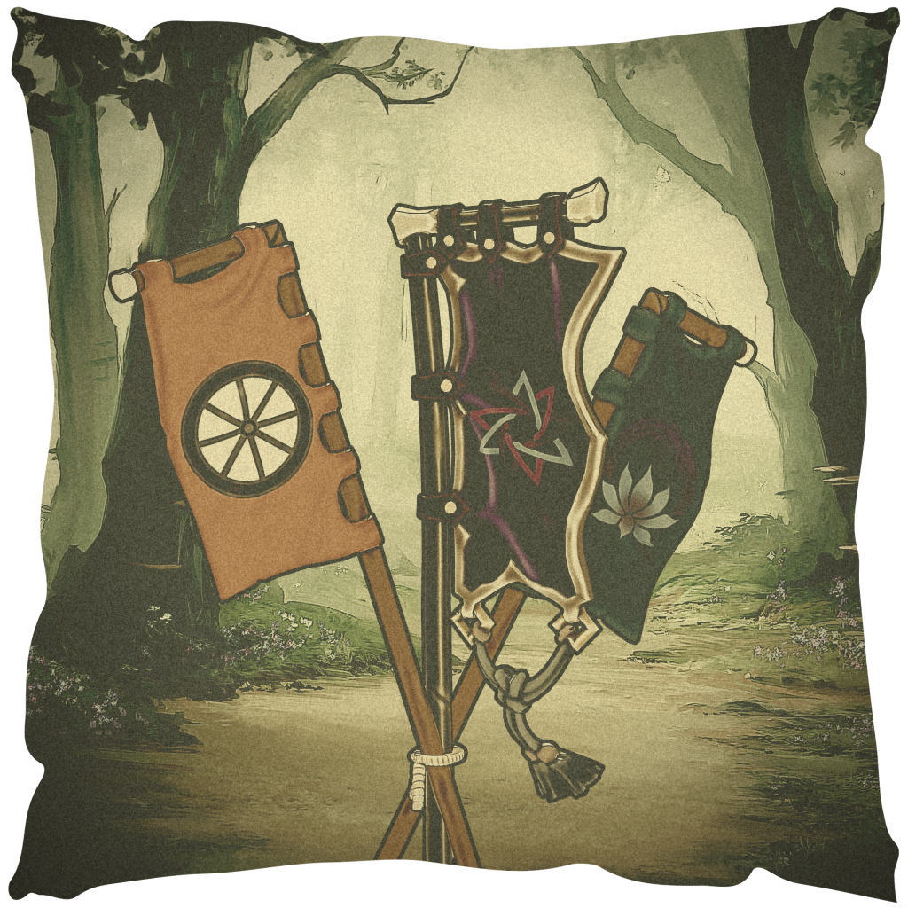
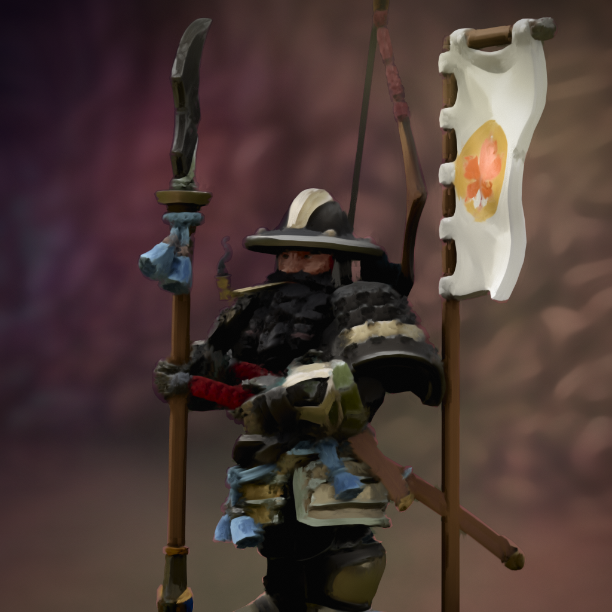

# Yama-Juunin
This repository will contain the necessary files to build a webpage describing the history and culture of the Yamabushi people (literal translation: "One who lies down on the mountain" -- google translate) in the country Yama Juunin ("Mountain Residents" -- google translate) for an Open Legends campaign.

---

The following include the pages and the content to be on each page, They will be re-ordered after I finish adding in the content. 

## History of Yama Juunin: 
Yama Juunin has had a very tubulent history, the mountains have had many civil wars and bloody conflicts. Most of these conflicts were power grabs from different clans that either ended in usurping the previous reign, splitting the region into two government powers, or greusome death for the rebels. 

## Culture:
> A cutlure is defined by the customs, arts, social institutions, and achievements of a particular nation, people, or other social group. 

Using that definition I will break this into groups. 

### Customs
- **The three paths**
  - The three paths are the heart of Yammabushi life: a philisophical trunity that governs all moral, social, and spiritual behavior. Every act, from combat to craftsmanship to meditation, is weighed against one's chosen path and its interpretation.
- The Sanctity of Writing:
  - To the Yammabushi, writing is not mere communication, it is manifestation. 
  - Words, once inscribed, are believed to shape reality itself. Thus to write is to bind the world, and to be written about is to be immortalized. 
  - Tenets:
    - Writing is sacred and immutable. Altering text is seen as an act of hubris unless sanctioned by one's path elder. 
    - Speech is transient, writing eternal. Oral debates and oaths are valued for passion, but word is reserved for truth. 
    - Written emotion is dangerous but divine. Because written words outlive authors, emotional writings aree seen as echoes of the soul, rare but deeply moving. 
  - Duels:
    - When two Yammabushi vassals duel, both must write a *final poem*. A distilled expression of their life's philosophy and acceptance of fate. 
    - These poems are often read aloud by witnesses before combat and preserved in communal archives. 
    - Victory is both physical and spiritual: to defeat another's philosophy is to test your own against eternity. 

---

  - Writing privalages by path:

  | Path | Cultural Relationship to Writing | Customary Practices | Spiritual Meaning | 
  | ---- | -------------------------------- | ------------------- | ----------------- |
  | Efficiency | Writing is a necessary act, tolerated rather than sacred. | Scribes record blueprints, alchemical formulae, and treatises. Misuse of this privilege may lead to a duel or challenge of skill (Creating a final figurine or invention). | Writing is a tool, precide, functional, and pure in purpose. |
  | Peace | Writing is restricted, except for dictation or noble lineage. | Members often serve as recorders, scribes for hire, inscribing dictated epitaphs, contracts, or final poems for others. | Writing represents compassion, giving others a voice, but rarely one's own. |
  | Honor | Writing is ritualistic, emotional,  and performed at moments of life or death | Final poems, oaths of cervice, and battle epistles are crafted with formal precision. | Writing is an offering; the soul's steel forged into words. |

---

  - Dictation and Class Dynamics
    - Dictation is a privilege of wealth and status. The lower classes often pay a follower of Peace to record their dying words or family histories. 
    - Dictation ceremonies are deeply emotional. Sometimes seen as the true moment of death, since one's final truth has been *"hammered into permenence."*
    - This gives followers of the path of peace subtle social power: though they rarely write their own truths, they hold the pen that records others'. 
  - Philisophical Implications:
    - Writing symbolizes the dwarves' worldview: **"Nothing is easy, everything must be earned, and all things must be shaped."**
    - To write is to forge meaning itself. 
    - Their written records (poems, treatises, or epitaphs) are less about communication and more about leaving behind a perfectly tempered truth. 

    ---

- Death is engraved into the Yammabushi
  - Isolation and Misunderstanding
    - The Yammabushi are a people apart. Their mountain citadels and subterranean cities are distant, but it is their philosophy that isolates them the most. 
    - To Outsiders, the Yammabushi appear calm and disciplined, yet sudden, decisive violence lurks beneath that serenity. A single insult to their Paths, or even an unintentional slight towards their customs, can end in blood. 
    - Thus the Yama Juunin is known across the lands as the *Realm of Panthers*--Silent, composed, and deadly when provoked.
    - Outsiders rarely grasp that for the Yammabushi, violence is not rage but correction. 
    - An insult is not merely offensive; it is a fracture in harmony, and like a crack in metal it myst be struck, reforged, or broken away entirely. 
  - The Normalcy of Death:
    - Centuries of war, duels, and "Philosophical purges" have made death a daily presence. 
    - The Yammabushi no longer treat it as a tragedy but as continuation. 
    - Every death is a hammer blow in the forgin of their people's destiny. 
      - Duels occur in open streets, often witnessed by kin or apprentices. The victors bow to the fallen, then to spectators who quietly return to theur business. 
      - The slain are collected swiftly, often by the Quiet Hand: an order of undertakers belonging to the Path of Peace. 
      - The scent of Iron and blood is said to cling to every city. Not from neglect, but from history itself. 
    - Death no longer shocks; it reminds. 
  - Cleanliness as Virtue
    - Because blood and death are constant companions, cleanliness became not merely practical but moral. 
    - A city that reeks of rot is not only unpleasant, it is seen as philisophically impure. 
    - **Cleanliness Laws:**
      - Public Hygien: Streets must be washed daily; corpses and waste removed within an hour of discovery. 
      - Inspections: Local officials from the Path of Efficiency perform routine checks; failure to meet standards results in heavy fines or forced labor. 
      - Religious Zeal: In rare cases, zealous lords mobilize troops against unclean towns, accusing them of betraying their Path.
        - Dishonor: For staining the purity of the spirit (Honor)
        - Disruption: For allowing pestilence to disturb balance (Path of Peace)
        - Imperfection: For wasting resources or effort (Efficiency)
      - To neglect cleanliness is to invite chaos.
      - To the Yammabushi, a spotless street is the sign of a people who respect both life and death. 
  - The Cultural Psychology of Death
    > *"Death is not an end, but a lesson. Only the untempered break under its weight." --Yammabushi Proverb*
    - The Yammabushi view life and death as part of the same forging process:
      - Birth: Shaping of unrefined ore. 
      - Life: The hammer's rhythm (choice, pain, purpose)
      - Death: The cooling of meatal. The moment one's form is set, and their essence judged by the wualuty of their temper. 
    - Even children learn this metaphor early. They are taught to treat every fallen warrior, craftsman, or philosopher not as lost but complete. 
  - The Yammabushi are isolated, especially compared to recent history. Outsiders find it dificult to understand the culture, and even at times will inadvertantly insult or demean the philosophy of the Yammabushi around them. Often times outsiders are killed due to this, garnering the Yama Juunin as a land of panthers: calm, quiet, yet deadly and cunning. 
  - due to the ammount of wars, minor conflicts, and philisophical duels leading to death, the people are rarely phased by death. If a duel happens in the streets, the witnesses (usually friends and familyu) will watch, but people will usually go about their days like it didn't happen. Seeing someone get killed is almost a weekly occurance, the cities and towns all have a disting iron scent of blood in the air. 
    - Due to this, the people have (by necesity) become very clean. The streets are clean, and a town that doesn't clean their streets, tend to corpses and waste, can invoke heavy fines. In rare cases, when a local lord is particularly zealous to their path, they may mobalize troops against the town and accuse them of anathema to the path. (Letting disease run and disturb the peace, bringing dishoner to themselves, or being inefficient--imperfect.)

  ---

#### Rituals of Death and Burial:
  - Among the Yammabushi, death is not the extinguishing of life, but the completion of tempering. 
  - Each path treats death as a reflection of its philosophy, the final test of whether one's discipline held true under pressure. 
  - Burial rites are less about mourning and more about honoring the form one achived in life. 

- **Path of Honor:**
    > *"To die as you lived. Unbroken. Unbent. Is to live forever." --Final Oath of the First Shogun*
    - Those who follow the Path of Honor view death as the final proof of integrity. Their ceremonies are steeped in ritual precision, and even in death, they are expected to uphold composure. 
    - Rituals:
      - Final Oath: Before death (whether by duel, battle, or sickness) a follower of Honor declares a Final Oath. Often a single sentence carved into a stone tablet or engraved upon their weapon. 
      - Cleansing of the Blade: Their weapon or armor is washed with their own blood, symbolizing the purification of both oath and self. 
      - Entombment: The dead are sealed in stone crypts with their oath tablets. The two are never separated.
      - Witnesses: Family and comrades stand silently, never weeping. To weep would imply the deceased failed to prepare for death. 
    - Cultural Notes: 
      - Their tombs are often inscribed only with symbols rather than names. A statement that the oath, not the self, is what endures. 
      - Breaking the peace of a warrior's tomb is a capital crime; their oaths are still believed to bind even in death. 

- **Path of Efficiency:**
  > *"Perfection wastes nothing, not even the body." -- Exerpt from a Ledger of Merit. author's name unknown*
  - To those on the Path of Efficiency, death is a resource, to be transformed, studied, put to purpose. 
  - They view the corpse as another form of matter, subject to refinement. 
  - Rituals:
    - The Reduction: Bodies are cremated in carefully controlled alchemical furnaces. The ashes are mixed with lime and oil to create a fine resin used to seal tools, walls, or machines. 
    - The Ledger of Merit: Before cremation, a bureaucrat or scholor records the deceased's lifetime achivements, innovations, or failures. This ledger determines where their ashes will be used. 
    - No Monuments: Efficiency demands anonymity. Monuments are considered vanity unless they serve a function. 
  - Cultural Notes: 
    - Some great machines or city walls are said to hold the essence of thousands. literal blood and bone made useful.
    - The path teaches that the closer one comes to perfect refinement in life, the fewer ashes remain after death. Some take this to an extreme, becoming aescetics.

- **Path of Peace**
  > *"As the mountain endures, so too must we learn to still ourselves." --Exerpt of <u>The Meditations</u>*
  - Followers of the Path of Peace view death as reunion. 
  - They believe that each soul returns to the silent heart of the mountain, wqere all conflict ceases. 
  - Rituals:
    - Silent Passage: The dead are carried deep into the volcanic caverns, wrrapped in white silk, and left upon stone ledges where heat and time turn them to dust. 
    - Medidtative chant: Monks chant a single tone, held as long as possible, to symbolize the merging of one breath into the eternal stillness. 
    - The Empty Marker: Families place an unmarked stone where the person once lived, representing absence; the highest form of peace. 
  - Cultural Notes:
    - Unlike the others, followers of Peace hold *Collective Rememberances*, long silent vigils where hundreds meditate together. 
    - Those who die violently are considered untempered; monks will sometimies seek to atone for their unrest through fasting or isolation. 

- **Heresy of the Unspoken**
  > *"No Path binds the dead" --Final words of an unspoken, moments before execution. Their name was stricken from memory*
  - Those of the Unspoken Path reject all ritual. 
  - Their followers are buried in secret or left unclaimed, both to hide their existence and to deny them any posthumous honor. 
  - Yet, whispers say their spirits wander unanchored, unpurified, still seeking a truth beyond all tempering. 

- **Summary Table:**

| Path           | View of Death        | Core Ritual                 | Symbolic Goal                  | Psychological Effect                |
| -------------- | -------------------- | --------------------------- | ------------------------------ | ----------------------------------- |
| **Honor**      | Test of integrity    | Final Oath & Entombment     | Purity of principle            | Stoic pride; death as fulfillment   |
| **Efficiency** | Refinement of matter | Cremation & Ledger of Merit | Transformation into usefulness | Detachment; purpose in productivity |
| **Peace**      | Return to stillness  | Silent Passage              | Dissolution into harmony       | Serenity; death as release          |
| **Unspoken**   | Rejection of order   | None / secrecy              | Denial of societal control     | Defiance; existential rebellion     |

### Arts

### Social Institutions
- List of the institutions so far.
  - Most of the institutions are defined by the Paths. 
  - Quiet Hand
  - The smaller towns are similar to manorialism, so most judicial matters come from members of the estate.
  - 
### Achievements

## The Three Paths:

> Once the old empire took control, the dwarves stalled their battleing and allowed their philosophy to evolve. Turning from a people who ask why and fight, and shift into people who ask why they fight. *The Three Paths*. These paths are not just a frivolus religion that some dwarves follow and others don't. It's their way of life, these philosophies are worth dying for in their eyes and many do. Magistrates swear to serve a lord by publicly swearing to follow one of the paths. If they break the path they are killed, outcast, imprissoned, or ostricized from a community.
- **The Three Paths**
  - Path of Honor
  - Path of Efficiency
  - Path of Peace
Each of the three paths has several sub paths that define and make up the parent path. These sub paths are not written or defined by the Yammabushi, but rather the natural channels and interpretations of what the philosophy is.
Through these paths the social order is built and maintained. 

---

### Path of Honor:
 
> *“In the age when Kaigen’s banners cast long shadows over the valley, there were those who swore their lives to the Path of Service. Among them stood the Oathbearers — warriors who carved their vows into steel and soul alike. Their armor was not fashioned for glory but for endurance; their banners, not for pride but remembrance.*
> *It is said that an Oathbearer’s armor was never removed in life, nor buried in death — for their oath transcended both. Each strike they endured was a prayer to endurance, each victory a hymn to duty. When one such warrior fell, his banner was folded and sealed with molten wax, its flame extinguished until another rose to bear the same creed." -Imperial Archive VII* 

To the Yammabushi, honor is not spoken — it is carried.”
- **Ideal:** Honor above all else
- **Typical Social Roles:** Warriors, Judges, Magistrates 
- **Cultural Flavor:** Oaths are forged into weapons, armor, or are engraved in a small stone tablet that the bearer takes with them everywhere. 
**Interpretations:** *[ ^= Most common interpretation]*

| Interpretation      | Role / Occupation                | Core Philosophy | Cultural / Psychological notes. |
| ------------------- | -------------------------------- | --------------- | ------------------------------- |
| Path of Ilumination | Vassals, Oathkeepers, Magistrates| Truth is absolute; deception and concealment are anathema | Believes any lie or hiddn action is dishonorable. Some duel over the most minor offenses. Wear bright armor, and engage in highly ritualized conduct. |
| Path of Oathbound^  | Vassals, Warriors | Honor is in keeping promises above all else. | Even mercy or practicality cannot justify breaking an oath. Creates rigid moral absolutists. |
| Path of Service^    | Retainers, Low Nobles, servants | Self-sacrifice is an ultimate honor. | Loyalty to others is paramount. Produces disciplined, loyal followers who may suppress personal desires. |
| Path of Pure Blood  | Aristocrats / elite warriors | Honor is a hereditary virtue | Can foster classism or eugenics. Strong emphasis on lineag and inherited nobility. |

### Path of Efficiency
- **Ideal:** Refinement is the ultimate manifestation of divinity
- **Social Roll:** Engineers, bureaucrats, alchemists, tacticians.
- **Cultural Flavor:** See invvention not as creation, but as refinement of what already exists. An inventor doesn't make, they perfects. 
- **Architecture and Tools:** Wcwet city and machine is built with modular precision, meant to be repaired, never replaced. Efficiency is not speed, it's eternal functionality. 
**Interpretations:** *[ ^= Most common interpretation]*

| Interpretation      | Role / Occupation                | Core Philosophy | Cultural / Psychological notes. |
| ------------------- | -------------------------------- | --------------- | ------------------------------- |
| Silent Forge^       | Artisans, Engineers, Alchemists  | Creation is sacred; work in silence | Often vow silence during work. Focused, methodical, emotionally restrained. |
| Golden Scale^       | Merchants, Traders, Bureaucrats  | Wealth and productivity are measures of moral worth. | Equates economic success with virtue. Can foster ruthless competition. |
| Calculated Mercy    | Scholars, Strategists, Advisors  | Decisions are based on outcomes rather than emotion. Can rationalize harsh, choices. | 

### Path of Peace:
- **Ideal:** Peace is the truest form of mastery.
- **Social Roll:** Monks, philosophers, healers, elemental magicians. 
- **Cultural Flavor:** Their meditation halls are built inside dormant volcanoes and deep caverns, places of immense pressure and silence. Peace is not the absence of tension, but mastery over it. 
**Interpretations:** *[ ^= Most common interpretation]*

| Interpretation        | Role / Occupation                 | Core Philosophy | Cultural / Psychological notes. |
| --------------------- | --------------------------------- | --------------- | ------------------------------- |
| Peace Through War^    | Warrior-monks, Elite Peacekeepers | Strength and readiness maintain serenity | Trains to fight only to prevent greater bloodshed. Weapons are symbols: sheathed, but always within reach. |  
| Compassionate Chains^ | Philosopher-lords, Enforcers, Vassals | Control as mercy; order prevents suffering | Kaigen's preferred ideology. Subjugation seen as kindness. Can justify authoritarian rule. |
| Last Breath           | Monks, Healers, Pacifists         | Absolute nonviolence; self-sacrifice | Believes in allowing oneself to be harmed rather than harming others. often seen as saints or fools. |

### Unspoken
This is a new path that is emerging in the unseen corners of Yamma Juunin. It's philosophy not fully defined, yet the current regime is aware of it, and the threat it may pose. They activly hunt those who practice it, accusing them of crimes, and subsequently execute them. 

| Path     | Role /Occupation                     | Core Philosophy  | Cultural / Psychological notes |
| -------- | ------------------------------------ | ---------------- | ------------------------------ |
| Unspoken | Ronin, Wanderers, Heretics, peasants | Reject all paths | Considered dangerous by orthodox society. Philosophical rebels. Can spark rebellion in those who subscribe to its practice |

## Geography & Maps
- Regional maps, travel notes, climate and terrain.

## Government & Politics
Ultimately, this is a feudal society. There are defined class systems, roles, and expectations with them. i.e. in britain, a lord of a manor was expected to provide protection to the free tennants and villanes that were under him, he was also expected to play the roll of judge in local disputes. The tennants are expected to work some of the Lords land in return. 

## Economy & Trade
- Resources
- markets
- trade routes
- currency.

---

- the cliche is that dwarves always are chief exporters of rare earth minerals, I'm debating reversing that, have them export stone and ingredients to make things like concrete, non-neutonian liquids, petrolium gell, and while this isn't an export yet they have most recently developed black powder. using it to make the first cannon in the world. (it's still pretty rudimentary and inacurate over more than 50 meters)

## Military & Defense
- Armed forces, fortifications, militia, threats.

## Law & Justice
- Courts, punishments, common legal disputes.

## Demographics
- Population, ethnic groups, social classes.

## Notable Locations & Districts
- Cities, temples, landmarks, inns.

## Factions, Guilds & Organizations
- Power groups, merchants, religious orders.

## Flora, Fauna & Bestiary
- Local wildlife, dangerous creatures, plants.

## Magic, Technology & Crafts
- Magical traditions, tech level, notable inventions.

## Languages & Naming Conventions
- Local tongues, common names, honorifics.

## Timeline & Major Events
- Key historical dates and recent happenings.

## Festivals, Holidays & Customs
- Annual events, rituals, etiquette.

## References, Credits & Sources
- Hero Forge:
  - Yamma-Juunin-Dwarf.png 
  - Three-Paths-Banners.png
  - Three-Paths-Banners-2.png  
- Maps:
  - Yamma-Juunin-Blank.png is the intelectual property of Benjamin Jensen.
